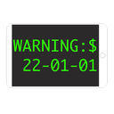
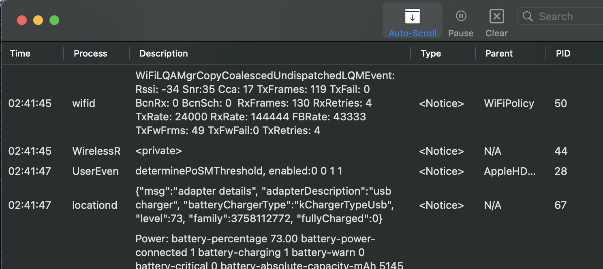

	
	<h1>iOSLogger</h1>

Here is another iOS log console for macOS. I've been using Lemonjar's iOS Console for more than three years. But it no longer works with the newer iOS version anymore. It might be one of the dependency issues (maybe *OpenSSL*). So I decided to make this. **iOSLogger** is just a simple program that captures logs from the internal service, '*com.apple.syslog_relay*', using the private *MobileDevice.framework* and shows it to the main app. There is also a tiny console binary, *TMobileDeviceConsole*, in the *Resources* folder that only does the capturing log things. It is nothing special and will be open source later.

## Download

Requires macOS 10.13 and later

## Screenshot

